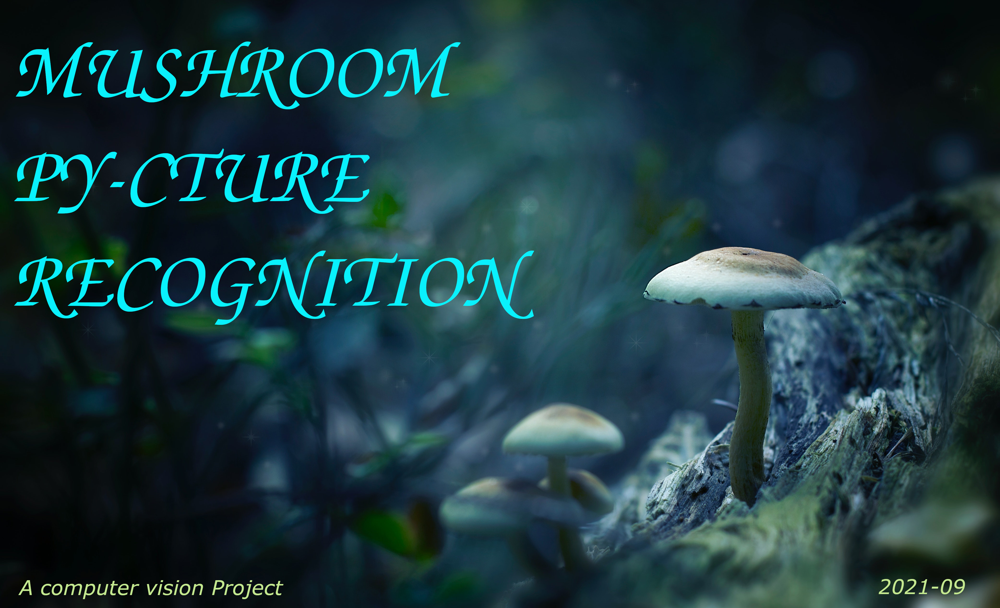

  

# Mushroom Py-cture Recognition

  

# The project

## Context

This project has been produced as part of the formation [Data Scientist](https://datascientest.com/formation-data-scientist) delivered by [DataScientest](https://datascientest.com/)  
-- class: December 2020 --

Project Name: **Mushroom Py-cture Recognition**  
*(Py: for python)*

## Objective

The objective of this project is to recognize mushrooms using computer vision algorithms.  
In machine learning terms the objective of this project is to produce a classifier ... and more precisely in the context of this project: a **mushroom classifier**.

Mushrooms have a large number of species and genus,
thus a wide variety of biological and nutritional characteristics, it can be interesting
to know how to classify them precisely using computer vision.

Through this project we decided to create a model that will be able to classify mushrooms according to their **genus**.

## Main features

You will find below all the major features used for the conception and implementation of this project:

<u>Development</u>  

   * language:
      * [**Python**](https://www.python.org/)

   * libraries:
      * [**Keras**](https://keras.io/)
      * [**Matplotlib**](https://matplotlib.org/)
      * [**Numpy**](https://numpy.org/)
      * [**Pandas**](https://pandas.pydata.org/)
      * [**Tensorflow**](https://www.tensorflow.org/?hl=fr)

<u>Support</u>

   * [**Jupyter Notebooks**](https://jupyter.org/)

<u>Dataset</u>

   * type: **images** + [**dataframes**](https://pandas.pydata.org/docs/user_guide/dsintro.html#dataframe)

<u>Domain</u>

   <table>
      <tr>
         <td><b><a href='https://en.wikipedia.org/wiki/Artificial_intelligence'>Artificial Intelligence</a></b></td>
         <td><b><a href='https://en.wikipedia.org/wiki/Computer_vision'>Computer Vision</a></b></td>
         <td><b><a href='https://en.wikipedia.org/wiki/Deep_learning'>Deep Learning</a></b></td>
      </tr>
   </table>

## Structure

This github repository contains only a part of the whole project.  
To get a better understanding of how this project was built just have a look below:

   * **Data**  
   
     We put in Google Drive all the <u>massive data</u> (that couldn't be stored in Github for storage reason).  
     The following data is concerned:  
     
       - dataset  
         in the context of this project the dataset consist in many thousands mushroom images.  
         Those images were used to make models learn to classify.
         
       - models  
         after being backed up to disk a model can necessitate many Mega bytes of disk space.  
         Multiple models were produced during this project and hence they are all stored in Google Drive.

     *Unfortunately the Google Drive used by this project is not available to public.*
     
     
   * **Code**

     This project was developped with Python.  
     Some part of the code was stored in classic Python files (*.py) and other part has been developped as Jupyter Notebooks.
     All the code (Python + Jupyter Notebooks) is available in this Github repository. 

   * **Report**

     A report has been drafted and is available in this Github repository (directory: "[report](https://github.com/DataScientest-Studio/Muhsroom_Py-cture_Recognition/blob/main/report/rapport.docx)").

   * **Demo Application** (go-live date September 2021)

     A demo application will be available soon in this Github repository (directory: "[demo](https://github.com/DataScientest-Studio/Muhsroom_Py-cture_Recognition/tree/main/demo)").  
     This demo has been built in Python with the [**streamlit**](https://streamlit.io/) library.  
     By using this demo you can use one of the model to classify yourself mushroom images.
     See "Practice" section below for more information.
     

# Practice

How to use a classifier produced by this project ?
[ ... this part is still under construction ... will be available soon ...]

# Contributors

Realized by:

   * David CHARLES-ELIE-NELSON
   * Oliver CONSTANTIN

Supervised by:

   * Louis (DataScientest)
   * Théophile (DataScientest)
   
